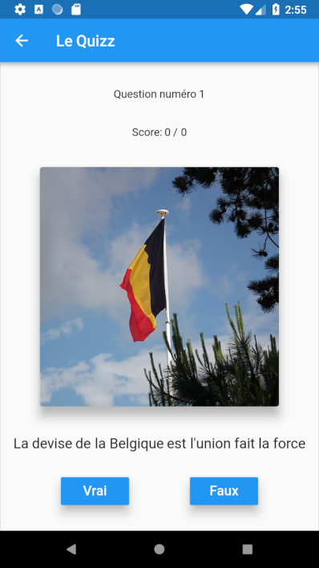
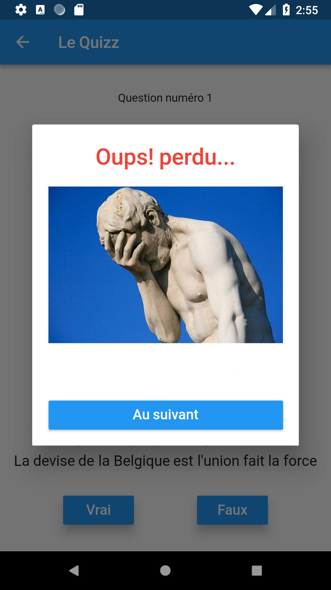

# Workshop flutter part 1

Flutter workshop to learn basics and create a first mobile application.
The App you will create will be a Quizz Game app.

You will learn different Flutter widgets and their usage.

This Workshop is organized for Epitech Innovation Hub.

## Workshop Setup

First, go to [Flutter Official Documentation](https://docs.flutter.dev/get-started/install) and do the setup in the order below.

#### System Requirements

1. Get the Flutter SDK
2. Update Your Path
3. Run `flutter doctor` (Be sure that it's working ...)

#### Platform Setup

##### Android Setup

1. Install Android Studio
2. Setup the Android Emulator
3. Agree to Android License

Do the next steps **Set up an Editor** and **Test Drive**.


## Exercise 1 - First Page

Now, the setup is done. Let's start our Quizz App.
You can find all the project's resources in the directory `quizz-assets`.
First, we will create our first page:


#### Tips:
Take a look at theses widgets:
- [Column](https://api.flutter.dev/flutter/widgets/Column-class.html)
- [Card](https://api.flutter.dev/flutter/material/Card-class.html)
- [Image](https://api.flutter.dev/flutter/widgets/Image-class.html)
- [RaisedButton](https://api.flutter.dev/flutter/material/RaisedButton-class.html)
- [Text](https://api.flutter.dev/flutter/widgets/Text-class.html)


## Exercise 2 - Navigate to a new page

Your first page is created, you can launch the game by pressing button.
So now, let's navigate to a new page !

1. Create a new page named **PageQuizz** which is a **Statefull Widget**. (Do it in a new Dart file and don't forget to import it)
2. Navigate from your first page to your **PageQuizz** page.


#### Tips:
You should be interested in:
- [Navigator](https://docs.flutter.dev/cookbook/navigation/navigation-basics)


## Exercise 3 - The class Question

1. Now, your are going to create a new class named **Question** in a new dart file.
This class will contain these attributes:
- `String question`
- `bool answer`
- `String explication`
- `String imagePath`

2. import your file in the **PageQuizz** page.
3. Create an instance of **Question** in the **PageQuizz** page.
4. Create a list of **Question** called `questionList` as in the example below:
```
Question("Belgium's motto is \"L'union fait la force\".", true, '', 'belgium.jpg'),
Question("The moon will eventually fall to Earth because of gravity", false, "On the contrary, the moon is moving away", 'moon.jpg'),
Question("Russia is larger in area than Pluto", true, '', 'russia.jpg'),
Question("Nyctalope is a dwarf breed of antelope", false, "It is an ability to see in the dark", 'nyctalope.jpg'),
Question("The Commodore 64 is the best selling desktop computer", true, '', 'commodore.jpg'),
Question("The name of the pirate flag is Black Skull", false, "It is called Jolly Roger", 'pirate.png'),
Question("Haddock is the name of Tintin's dog", false, "It is Milou", 'tintin.jpg'),
Question("The beard of the pharaohs was false", true, "Already at that time they used hairpieces", 'pharao.jpg'),
Question("In Quebec, \"tire toi une buche\" means come and sit down", true, "The log, the famous lumberjack's chair", 'log.jpg'),
Question("The lunar module Eagle had 4Kb of RAM", true, "I can't believe I'm complaining with my 8GB of ram on my pc", 'eagle.jpg')
```
5. Create two variables `int index = 0` and `int score = 0`
6. Create an **initState** method: It is the method first called when the page is created.
7. Add `question = questionList[index]` in the **initState** to set the instance of Question in the **QuizzPqge** at the first question of the list.


## Exercise 4 - The Question Page UI

At this time, you have your first page to launch the game, you be able to navigate between different pages and you got your class **Question**.
So now, you are going to create the UI of a question.



> Use your questionList to fill informations


## Exercise 5 - The Answer Dialog

Now, you will create a popup when you press on **True** or **False** buttons.
You have to check if the button pressed is the same as the bool attribute of the question in the `questionList` at current index.

If the answer is right, your popup might look like this:


And if the answer is wrong:



#### Tips:

- Take a look at [onPressed](https://googleflutter.com/flutter-button-onpressed/) method.
- Take a look at [SimpleDialog](https://api.flutter.dev/flutter/material/SimpleDialog-class.html) widget.
- Don't forget to increment the score if the answer is right.


## Exercise 6 - The Game logic

Now, you are going to move on the next question.
- First, you have to call `Navigator.pop(context)` method to make disappear the **SimpleDialog** when you press the "Next Question" button.
- Create a function `nextQuestion` which check if the current question is lower than `questionList.length` and if it's right, increment the index to move on the 
next question.
- Take a look at [setState](https://api.flutter.dev/flutter/widgets/State/setState.html) method which allows to refresh the page and come back in the `initState` to change the current question.
```
if (index < questionList.length - 1) {
  index++;
  setState(() {
    question = questionList[index]
  });
} else 
// Call an AlertDialog to inform the player that the game is over and display he's score.
// You can add a button to allow player to come back at the first page.
```

Congratulations! You have successfully created your first mobile app in Flutter.

We hope you enjoyed this workshop and we encourage you to continue learning Flutter.


## Authors

- Ilan BENARROCHE (ilan.benarroche@epitech.eu)
- Arsene MATHIEU (arsene.mathieu@epitech.eu)
